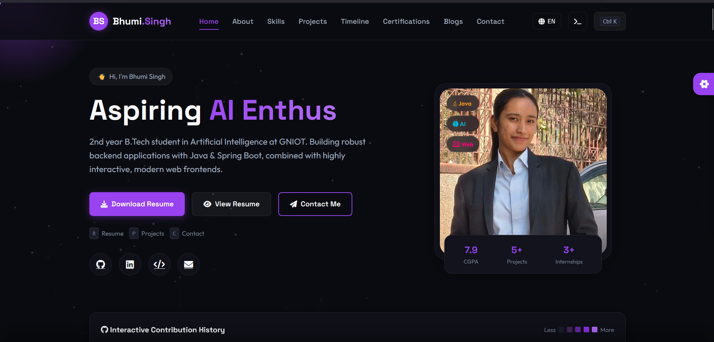
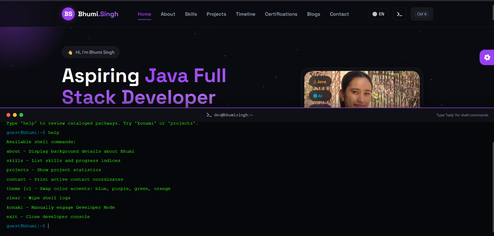
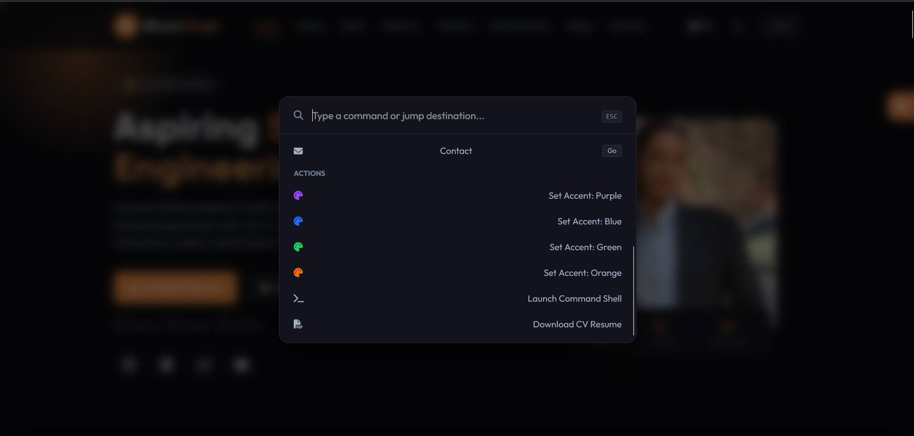
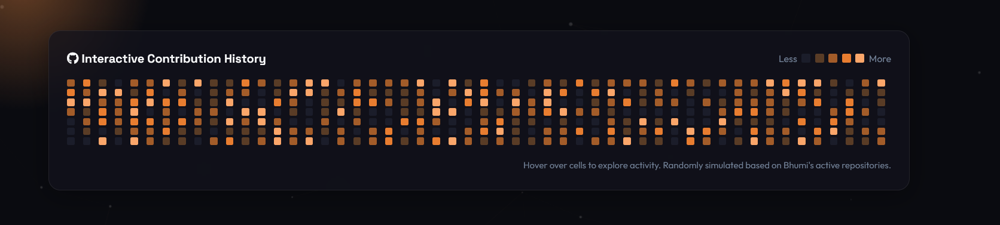
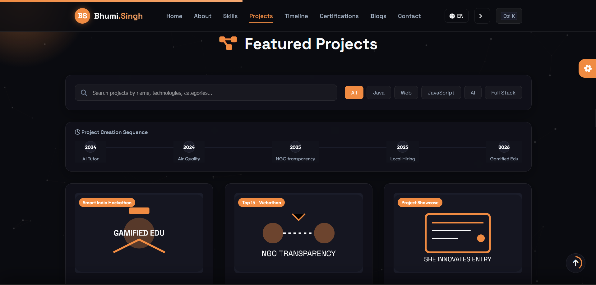
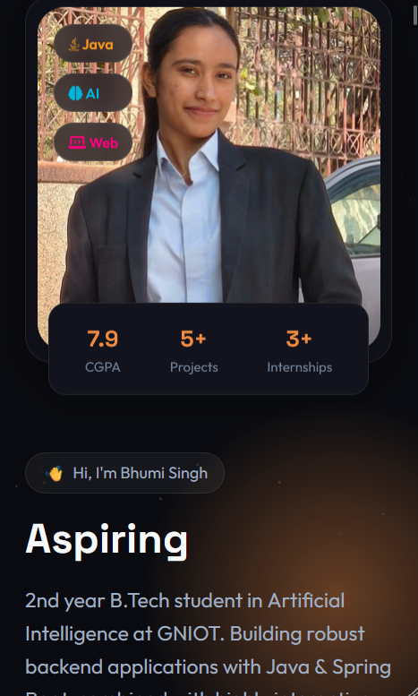
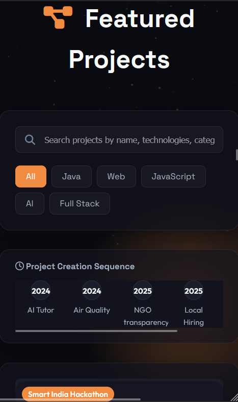
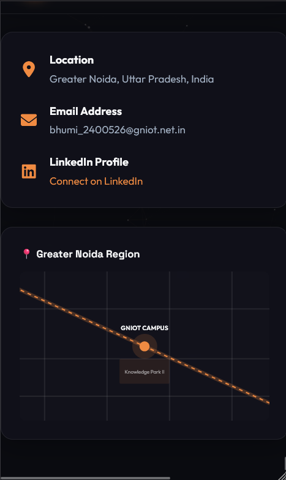
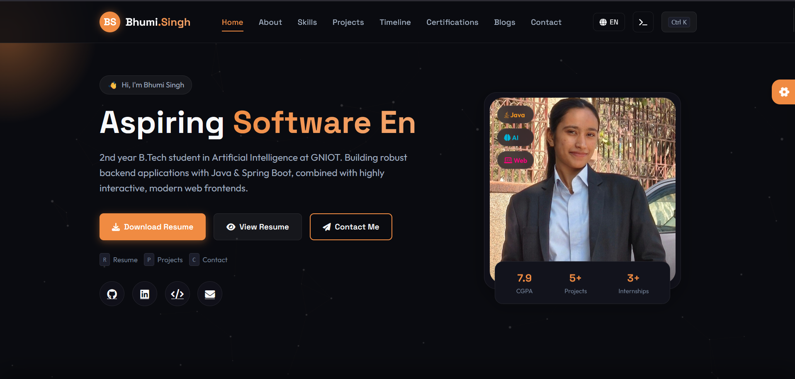
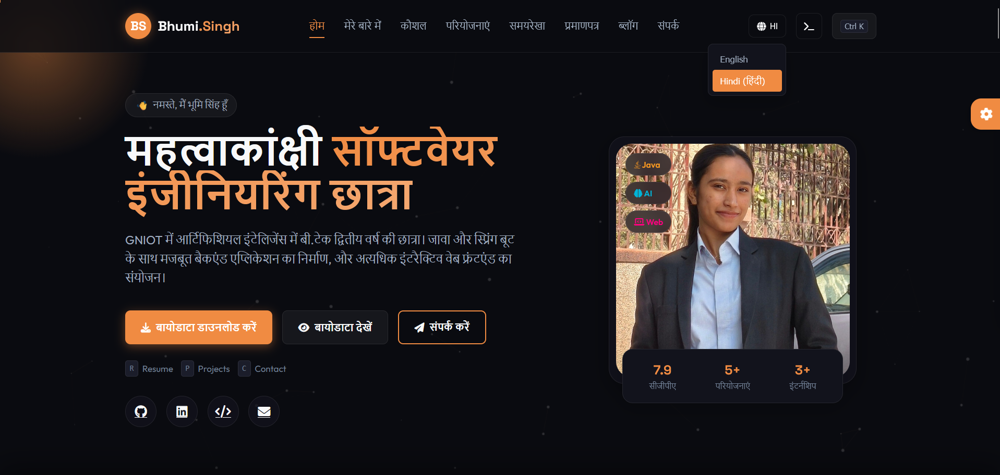

# 🚀 Bhumi Singh | Premium Interactive Developer Portfolio

<div align="center">


### ✨ A modern, fully interactive, glassmorphic developer portfolio built using Vanilla HTML, CSS & JavaScript.

**Designed to provide a premium desktop-class experience with advanced animations, developer tools, customizable themes, multilingual support, and interactive widgets.**

</div>

---

# 🌐 Live Demo

> 🔗 **Portfolio:** bhummi-portfolio.netlify.app

---

# 📸 Screenshots

## 🏠 Home Page



---

## 💻 Developer Console (CLI)



---

## 🎨 Theme Customizer



---

## 📊 GitHub Dashboard



---

## 📂 Projects Section



---

## 📱 Mobile Responsive Design

| Home | Projects | Contact |
|------|----------|----------|
|  |  |  |

---

🇺🇸 English/🇮🇳 Hindi
## 🗣️ 🇺🇸 English/🇮🇳 Hindi




---

# ✨ Features

## 🎨 Premium UI

- Modern Glassmorphism Design
- Animated Gradient Background
- Cursor Glow Effects
- Scroll Progress Indicator
- Floating Navigation
- Fully Responsive Layout
- Dark / Light Mode
- Dynamic Accent Colors
- Smooth Scroll Animations

---

## ⚡ Interactive Components

- Interactive Project Cards
- Resume Preview
- Animated Statistics
- GitHub Contribution Heatmap
- Tech Stack Explorer
- Timeline Navigation
- Project Detail Modals

---

## 💻 Developer Experience

- VS Code Style Command Palette
- Interactive CLI Terminal
- Matrix Rain Easter Egg
- Keyboard Shortcuts
- LocalStorage Preferences
- Theme Persistence

---

## 🌍 Localization

Supports

- 🇺🇸 English
- 🇮🇳 Hindi

Entire interface translates including

- Navbar
- Hero
- About
- Projects
- Contact
- Statistics
- Typing Animation
- Buttons

---

# 🖥 Developer Console Commands

| Command | Description |
|----------|------------|
| help | List all commands |
| about | Portfolio information |
| skills | Show tech stack |
| projects | List featured projects |
| contact | Contact information |
| theme blue | Change theme |
| theme green | Change theme |
| theme orange | Change theme |
| theme purple | Change theme |
| konami | Matrix Mode |
| clear | Clear terminal |
| exit | Close terminal |

---

# ⌨ Keyboard Shortcuts

| Shortcut | Action |
|-----------|---------|
| Ctrl + K | Open Command Palette |
| Alt + T | Open Developer Console |
| R | Resume Preview |
| P | Scroll to Projects |
| C | Scroll to Contact |
| ESC | Close Active Window |

---

# 🛠 Tech Stack

### Frontend

- HTML5
- CSS3
- JavaScript (ES6)

### UI

- Glassmorphism
- CSS Animations
- CSS Variables
- HSL Color System

### Storage

- LocalStorage API

### Graphics

- HTML Canvas API
- SVG
- CSS Filters

---

# 📂 Project Structure

```text
TechNova_PortfolioWebsite/
│
├── index.html
├── styles.css
├── script.js
├── profile.jpg
├── screenshots/
│   ├── home.png
│   ├── projects.png
│   ├── terminal.png
│   ├── dashboard.png
│   ├── customizer.png
│   ├── mobile-home.png
│   ├── mobile-projects.png
│   └── mobile-contact.png
│
├── README.md
└── DEPLOYMENT_GUIDE.md
```

---

# 🚀 Installation

```bash
git clone https://github.com/bhumisingh200/Portfolio.git

cd TechNova_PortfolioWebsite

python -m http.server 5500
```

Visit

```
http://localhost:5500
```

---

# 🎯 Performance Highlights

✔ Pure Vanilla JavaScript

✔ No Frameworks

✔ Lightweight

✔ Fully Responsive

✔ Optimized Animations

✔ LocalStorage Support

✔ Keyboard Accessible

✔ Mobile Friendly

---

# 🚀 Future Improvements

- AI Chat Assistant
- Blog Section
- Dynamic GitHub API Integration
- Visitor Analytics Dashboard
- Multi-theme Library
- Particle Customizer
- Project Search
- Admin Dashboard
- CMS Integration
- PWA Support

---

# 🤝 Connect With Me

### 👩‍💻 Bhumi Singh

📧 bhumi_2400526@gniot.net.in

💼 LinkedIn

https://linkedin.com/in/bhumi-singh-97818830b

💻 GitHub

https://github.com/bhumisingh200

---

# ⭐ Support

If you found this project helpful, consider giving it a ⭐ on GitHub.

---

<div align="center">

### Made with ❤️ by Bhumi Singh

</div>